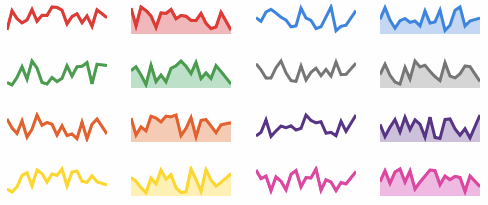

# mithril-sparkline


Generate SVG sparklines with Mithril. Based on [SVG sparkline by fnando](https://github.com/fnando/sparkline), but converted to a TypeScript-based Mithril component.




## Installation

This lib is available as a NPM package. To install it, use the following command:

```bash
npm install mithril-sparkline --save
```

If you're using PNPM (and you should):

```bash
pnpm install mithril-sparkline
```

## API

### Sparkline

This package exposes a [Mithril](https://mithril.js.org/) component, `Sparkline`, which can be used as any other component. It has the following attributes:

- entries: Array of numbers, or Array<{ value: number }>.
  Alternatively, you can use your own datatype and specify `options.fetch`.
- width: number; Width of the SVG.
- height: number; Height of the SVG.
- strokeWidth: number.
- options: SparklineOptions (see below).

```ts
export type SparklineOptions<T = SparklineEntry> = {
  /**
   * This function will be called whenever the mouse moves over the SVG.
   * You can use it to render something like a tooltip.
   */
  onmousemove: (event: MouseEvent, value: SparklineMouseMove<T>) => void;
  /**
   * This function will be called whenever the mouse leaves the SVG area.
   * You can use it to hide the tooltip.
   */
  onmouseout: (event: MouseEvent) => void;
  /**
   * Should we run in interactive mode?
   * If yes, this will handle the cursor and spot position when moving the mouse.
   */
  interactive?: boolean;
  /**
   * Define the size of the spot area (circle highlighting the selected point).
   * @default 2
   */
  spotRadius?: number;
  /**
   * Define the width of the cursor (vertical line).
   * @default 2
   */
  cursorWidth?: number;
  /**
   * By default, data must be formatted as an array of numbers or
   * an array of objects with the value key (like `[{value: 1}]`).
   * You can set a custom function to return data for a different data structure.
   */
  fetch?: (entry: T[]) => number;
};
```

## Usage

This is the minimum working example. A more elaborate example can be found [on CodePen](https://codepen.io/erikvullings/pen/bGRXqzE) or you can play with the source code [here](https://flems.io/#0=N4IgzgpgNhDGAuEAmIBcIB08wgDQgDMBLGHVAbVADsBDAWwjRDqPgAsAnEgWjAAcaHANZQiVCFhz5YAeyqJ5TCAA8+MjvAAE8AJ58ImgMoDho8QFF5HHZoC8m4JoBuNKAFcIqTVTd0ARhAcmgC+ANwAOlSRKmoa2noGxoIiYhAAsjJukBlOEAA8ACp2RiYpFlY6AHzFwJGamkg08DReBRFU9cpePv6B7fU63b4BHP2aYkgqQ72jkWGR0arqWrr6JclmEADyfPBEcmCFxUmmqZbw1tX2tR2aAPQAVA919Q+aBWxEYJoEblQI+w6AHcSFBNAFNLBXDAkJogWwIOJckF2AY6JlIJp0blvjJkdoEUYAGoAcQwL00bwAmplITQOlkDKxtDJNBxEZMgmAZAx2GIAOaaURCAw0FkyKB7Pjk26Uu4vOToxnYzyaAAUEFy8i8GUZ5i18FwzlcHi8JzK6QxltyhUqAEo7NUnDIiEgxo9nrK3h8vj8-gC5HDQeCDFCoDC4QikYECWirUKIDQcbHiSTNIJEzL6pTNDS3HSGZjmfBWZ9JimSxKpVnXvLboqrZl4F4NQadVb9Yj4A7bE6XW6Xh6KW9DGxMlBYUCDBw-uMOmJEBwaADcliZJMAPzDzQASQImh0EDARr53xB4c0bHpSBgKdgbg43KC180-BkWjUYFYgMjiLXTgFFMlUgGs5ReBdAmXPZcg3Lw-BkCVEyod0nm3AARCBiHEFMvwALwMGR91RV81C0DMaFAt4AAFJgIGg3ElTQACZhzreo33gAAlGgkCILJYO8YY+kHVCvU0DCsIMYiQSQdhNEIu8HyfdVkT2MMhVSO1KM0GjMPoxiWK9NjISU9QAHVXXYASehGFDPWzN4ACEbFo-TDQaJoxToLItAhAh1DoJpEFhGhvnpdMOCXGwFJswJcQ4bdwsEKL5P3GQ-AAKzgbAgzk4iXHcAwRRsNVhQMAADSgCtNTQAEZggAXXKrTtzzAtXwgMiTLAEs6D9f49kDEs2U6h8OkaZofnUdMGiIAgCECLsPMmnqZwQB8JFYl4FvgWA2AEjUKlacgGp7apYtmKh5iif4Di0c1NmKI57Aes4KkqNU7S8ABhHk1HEeQ8hueouy4I9joasYZPYaZbJeBEiH5Nhm0EmYxlWmQRQs2S2Fh4T612QEwDNUpNh2QaqEOApKnaYIrmqYH7juIweVFDg-FYJdrGNQqWRGlVFMfaaXw4+S3C0BT8qICAQSoQUoSoFwwBrWRKYl+awFgdk-3sbhaoABkN9pB2ZwxmkQY0uBoPxSBeGAtGUYpCIITXteQu3OoPJ2Na1iBEWN25VZ6zR+U6qlijVQKulRkYjQRpGUYuo1ePmvGOCNarVQus6KU0ExIAAMSgGQmjVNV4+RzRuBUk0DDeCvu3uLEaEdgBqWb5q0ksC6IZRkDVJi7TtAP6iDrRXIY+AC86vaI9BwZ1lOcoLh0M7NHnjBM5Hkb4DGhxc4AmWW0Z7N03gC5if32VT-XqxpePXPT+h3HXycflsfYXBH+zBuvDAN+AASEBEbIy-tfU+GMsaWTYGAm+2YZCEwODUYIsCb4oNzsENeJ9sxzXVKDe+GAYByzknkewtUHTYNPuyXeHB3bgJCAsehY8r5wPqA2ZUeIICoLgewyATZuE3wgkuFcBh7C8IgALDcPxXCYi8BcDwAiIGkW4rxLIxQmKKOzPeIWHAP5sHUZo+oO1Z72AnpKaeu0YHf2CE7RBlMxin2YRxNCRB6CdRjPYDiKi+LfDeExbep87jM04p1MGq45BQBsJnY869QqAWIlhWE-kUSEijkQbyfVM6gS0XdHmHhvj2DVN-eoqwIAKXwUecg+sGp2FsPYAA5BdepxTsxSIqWAFp9QvDtIwIFPgZd55r2MWwQ6K90xhSoKvO038HShRjoEE6ATsxBPeISdkVBOSAWfkGC8y5ZB-C0MknCpFXxEHwtk0euTtmeLfnoquJF3wuLcYuHM-jGFwJWR8acHJAiAQbumWA+z5DfCOZAgw2yRYnLwptJhuT-k3P5EAkBWhq5gruX4+5zjXG8nxt-T5qSW7pN8HkiQqzfS+kZLCYaYZ7xQCaFJQk4dZDqFhOU5c+j+AbFSMtGgagFwXMhLkqOxQ0hNDYL0luaoMDSuicPd5N8VnfXZQygwdLg6sAkXOSYygBXMLVfAHciA6A7g2SoYo0TCGIn5HJautUln1EVa4Wl9KUwAA1BUsvBKFAwPUIDSm-k4xAfBDBnIgO6+w2zmb6sNRIk12r7VM00AAiUIULwTV5S6YFRp4REFnr6eE9L8RThDu+cZKZ5553cN8ZQdwbDMo4EgCZVLCQTBULq3J6a+XAvNbXZWfSy5OCNK25Qa81SUOzOm7pd9KnDoaoYrVKh53R2HTmX1wbQ3uvbli55gR50L1DvAKkkcW5x2AQnI0aLoGaC3coniPiM52k0ZguVN0PnM2TROFMj1628VoIgZWAbckCHYOHewB6j1R1Pcii9FxMYQDuTe983isgZ17VU06DiclqzzmK36LKCktPKmkAAJMAbdOKOA2NI8BtgVIbHlWvS0ztmbsASv6WqJAa9yoABlNCkaQBgZQVHgACZ0MEZqGAMqZrVPUzQ9SX2Aew8QcMeGG0FM0OVajuGEJqZsUSPjZHAFnuRjY3jpHyPuMowZ-+iLjPwBsQALXKgm6he86BFPofUepNn6nzscM-P+tzoFQYToF2z0HXy6BgF4epymoBwTpbAIQsn0Gec0OQTpWIZM0YwJypeEBuDcDi+QMFtgqByAgA1XzDgGheDi6pxtIRH2Zfc-UnLeWLSFc2OQOLZWKtVaNI4JAXgaMNe+Jg+d9QhFQSIKuAAZHN9LmX6jufKpsXLpNUiFe0U+ErsGRTcGfrYUjO3zLQMauVQby3szKFql4ZQk2b7KCYvdx7p8dB3c0PrN72YdAvdfuF8912JvXda7AIgHBYAwA21y8QhWOLVccLAaOD3IQLx0EaDgf9b2qPG81tLp9WvsgQDD-LhXpsBioNwOlh4OCI+u+xKLqpYugjkUuSmJguyhEixwODbP6R5a7L5hnQYcZhb0T9+ov8AdIqBwTm+4imwtk1F2dseoDRYJF50YoNgxE+zdph1hCuqDATKeLTQC35Im8bOLVsXYX1G7galx3xvTcqmV22TQupICdnkJr+XcDmGm-DevA0GBnaQHgK6w3LvBXYavFAAgZs-XFDXSG-C7rmZvIDzfZh2j1nwDQp5AACixuwWuJ2eS7axxJZdOOOi92KjA1swAccE-c4PDpSGXlcEnoNDoAA+A+K-1GYwuMA5Bo1GrjSoSG8rY83eKPnrsRfmil-5coGPLvdcmUiivkvLGMA6ATS78RAtLdn84Xb+QRpl-yFXzQdffut+sOd7HkH8u50tK--Qh32Y3-XTXSLCxDjx6STyLwWjtB4DgDQDZRExMC1QABsAA7KgPrCACgtQG4kwJINAarAoPAEwOkiARAY9AQLzn1PUhgHcCwOwFwFALwJtuIM0jdPbCSsUPUvUu0GwSWHwMUPrNwZ7DAAQFoPYAIYwswrynwdcC8IfECC2GvBltfO5q9OIINpoN-O0l4OQLVEaAAKxGgaKaAAAsRoAAHEaAAMxGjIFzoaH0KXpi6aDWHfwBbOGGxGjfzS56HfbfwIIUyXzjpTbyCQQiJs4KItJeJ3pZBeCmEtKK7iwKEN6ZwcHC5paX65Ae5dhGiDIN5BHZgpH2DlQP5nwLqOykYbzDrBBeAVEVAYDpriYv4lIILFAq7yDh4axhxNEJgiGtFh4R6dSbrMTiFpZv6nzBAYL46nwpGW6tacpUBYAISShEB8CI6RY6DRYaa8E1HAC8HBB8Cb49EoykbCH2YHEMYoIkpTGaA-4TE3R0C9KZDyAcYyD3gMDtHwRIAY7ph8B8B2jQGQAwCU5kAgD6yoCWGWEYG4BYEMA4GwBgBSAgD4FdhMCPCaAZQ+RfrcoPB1ik4WgsI8584jQDi3BxbdAVa0yMJomPQghySfBIyiAJwRSJhgQLEdaPSMxgpeDsgklGKs5sj8h+A0ADx6EGFfZGjfaaAYCWEvp3GRBol7T0ihzHKlqyDFxBA4mRB4mbDw4nKcn7aqg2weBjBkngiFSUk3QKlXhywqq77KRqnTSalslMEFbcCnZBD6m84igJbGlzBUlvA9QbEGBxbMligvjfoSjqDfBZCAT8BwBzS5qQhqrfC0AMCsnalbZFbBiMymkcCCnClMSikSnFlSkykWlansmZkckvBcnEnlkLGVjLF8GMyfjfhyBeAt4SjiwQBjBClJb8i85-DDYClClqiSnjlGgYDIF-4OlY6aAADE80BAYwAgSAv6-IXgTEBxmgehBxJpcg8AvAoaXgtUW5m+LwOaiAjBy4WcMgQIS4fAYwuE3Aw6XgAAnB+W+bTACbAcCUwExGCbVMYRgXOiAGYEIGQJQCAKmYwOgLQZwCQNAQ+FAEwMjPAHwMTEEn8HwEIPyBgLIHQDQawAhVAFRExBgPrBgMYURXQSQL0mIJJoiaUkwK7CsYQY1MEEAA):

```ts
import { Sparkline } from './sparkline'

const app = {
  view: () => [
    m(Sparkline, { entries: [1, 5, 2, 4, 8, 3, 7], width: 300, height: 50 }),
  ],
}

m.mount(document.body, app);
```

You can change the colours by using CSS, like the following:

```css
/* just the line */
.sparkline {
  stroke: red;
  fill: none;
}

/* line with highlight area */
.sparkline {
  stroke: red;
  fill: rgba(255, 0, 0, .3);
}

/* change the spot color */
.sparkline--spot {
  stroke: blue;
  fill: blue;
}

/* change the cursor color */
.sparkline--cursor {
  stroke: orange;
}

/* style fill area and line colors using specific class name */
.sparkline--fill {
  fill: rgba(255, 0, 0, .3);
}

.sparkline--line {
  stroke: red;
}
```
